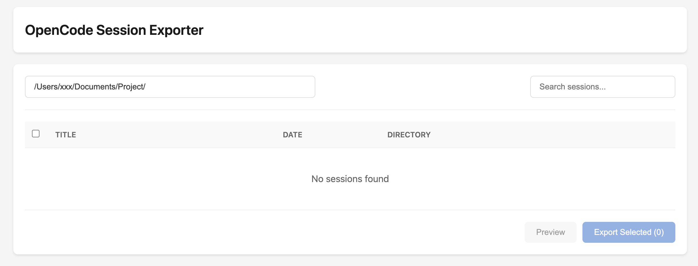

# OpenCode Session Exporter

Export OpenCode sessions to Markdown files. Provides both CLI and web UI interfaces.



## Features

- List OpenCode sessions
- Export sessions to Markdown format with reasoning and tool calls
- Web interface for session management
- Search and filter sessions

## Prerequisites

- Python 3.8+
- [OpenCode](https://github.com/anomalyco/opencode) CLI installed and in PATH

## Installation

```bash
pip install -r requirements.txt
```

## Usage

### Web UI (Recommended)

```bash
cd opencode_session_exporter
python app.py
```

Then open http://127.0.0.1:8000 in your browser.

Features:
- Browse and search sessions
- Preview session content before exporting
- Select and export multiple sessions at once

### CLI

```python
from exporter import list_sessions, export_single_session

# List sessions
sessions = list_sessions()
for s in sessions:
    print(f"{s.id}: {s.title}")

# Export a session
filename = export_single_session("session-id", output_dir="./exports")
```

### Programmatic API

```python
from exporter import (
    list_sessions,
    export_session,
    convert_to_markdown,
    save_markdown
)

# Get session data
data = export_session("session-id")
if data:
    # Convert to markdown
    md = convert_to_markdown(data)
    # Save to file
    filename = save_markdown(md, data["title"], data["updated"], "./output")
```

## API Endpoints

- `GET /` - Web UI
- `GET /api/sessions` - List all sessions
- `GET /api/sessions/{session_id}` - Get session details
- `POST /api/export` - Export sessions to Markdown
- `GET /api/directories?path=/path` - List directories in path

## Output

Exported Markdown files include:
- Session metadata (title, date, directory)
- Human messages
- AI responses with reasoning (collapsed by default)
- Tool calls made during the session

Files are saved to `opencode_session_exporter/export/` with naming pattern:
`YYYY-MM-DD_HH-MM_Title.md`